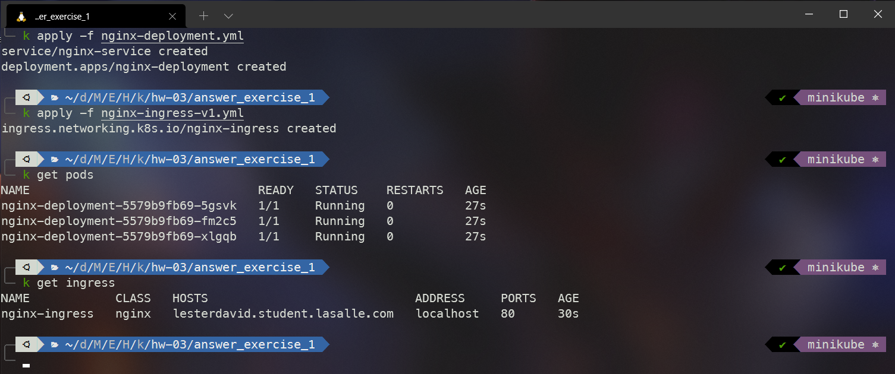
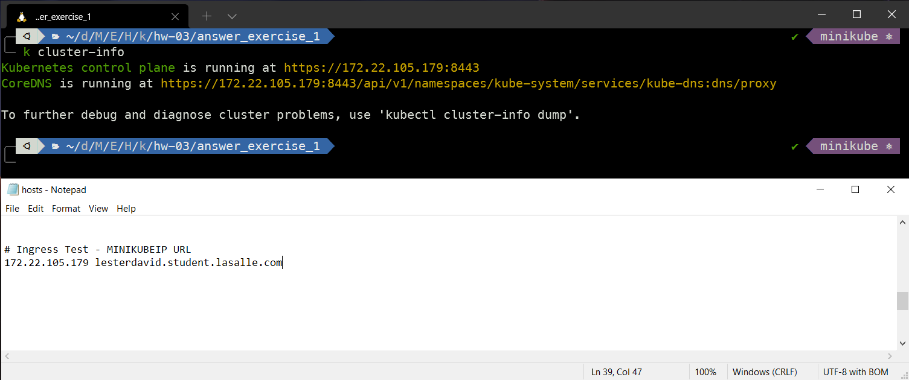
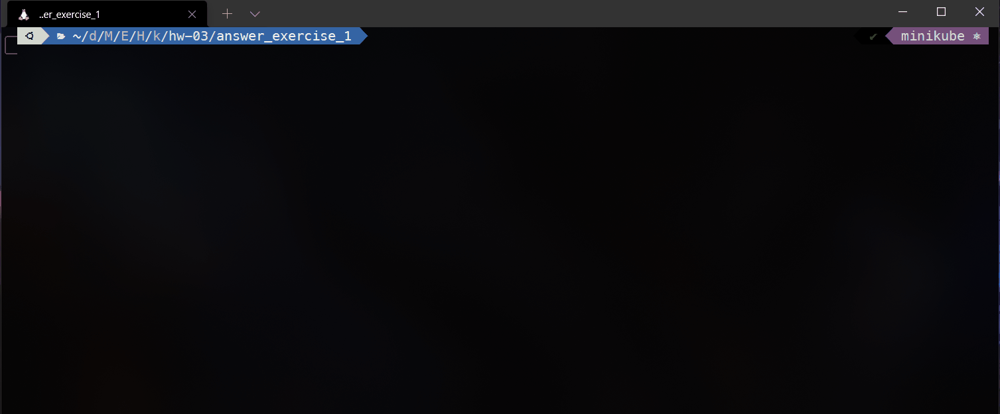
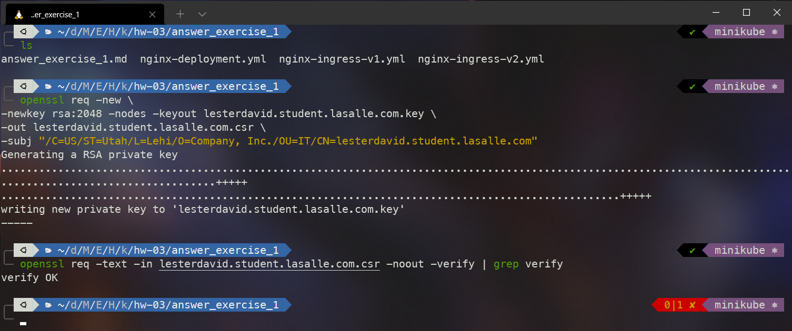
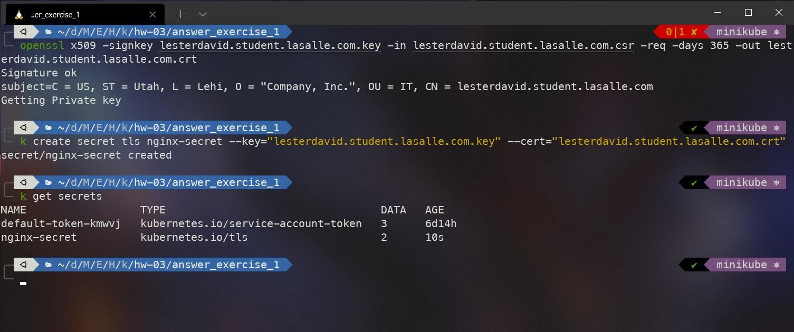
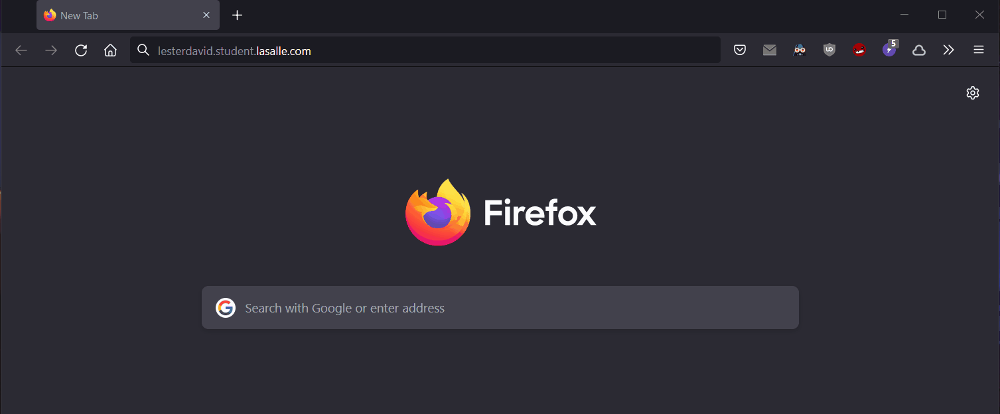

# answer_exercise_1

## Ingress Controller / Secrets

1. Creación de los objetos `Service`, `Deployment` e `Ingress`.

```
k apply -f nginx-deployment.yml
k apply -f nginx-ingress-v1.yml
k get pods
k get ingress
```



2. Modificar el archivo host con la ip del cluster. Estoy utilizando `Minikube` en `Windows`, pero lo acceso a través de `WSL`.

```
# En Windows es el archivo:
C:\Windows\System32\drivers\etc\hosts
```



3. Ver el resultado en el navegador y la terminal.

```
curl -k http://lesterdavid.student.lasalle.com
```



4. Creación del certificado utilizando `OpenSSL`.

```
openssl req -new \
-newkey rsa:2048 -nodes -keyout lesterdavid.student.lasalle.com.key \
-out lesterdavid.student.lasalle.com.csr \
-subj "/C=US/ST=Utah/L=Lehi/O=Company, Inc./OU=IT/CN=lesterdavid.student.lasalle.com"
```

```
# Para verificar el certificado
openssl req -text -in lesterdavid.student.lasalle.com.csr -noout -verify | grep verify
```



5. Firmar el certificado y creación del objeto `Secret` que será utilizado por el objeto `Ingress`

```
# Firmar el certificado
openssl x509 -signkey lesterdavid.student.lasalle.com.key -in lesterdavid.student.lasalle.com.csr -req -days 365 -out lesterdavid.student.lasalle.com.crt
```

```
k create secret tls nginx-secret --key="lesterdavid.student.lasalle.com.key" --cert="lesterdavid.student.lasalle.com.crt"

k get secrets
```



6. Modificar el objeto `Ingress` con el secreto

```yml
apiVersion: networking.k8s.io/v1
kind: Ingress
metadata:
  name: nginx-ingress
  annotations:
    nginx.ingress.kubernetes.io/rewrite-target: /$1
spec:
  tls:
    - hosts:
        - lesterdavid.student.lasalle.com
      secretName: nginx-secret
  rules:
    - host: lesterdavid.student.lasalle.com
      http:
        paths:
          - path: /
            pathType: Prefix
            backend:
              service:
                name: nginx-service
                port:
                  number: 80
```

```
k apply -f nginx-ingress-v2.yml

curl --cacert lesterdavid.student.lasalle.com.crt https://lesterdavid.student.lasalle.com
```


