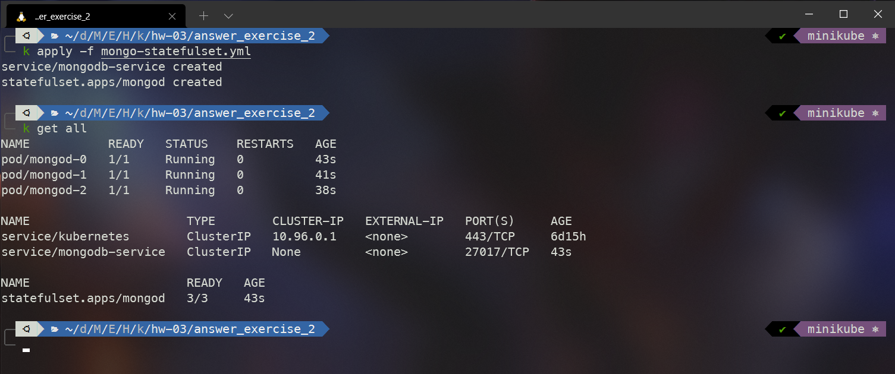
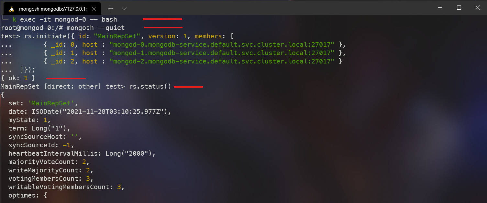
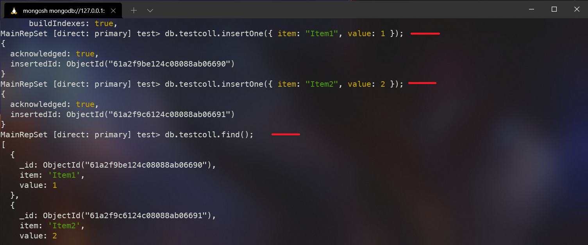
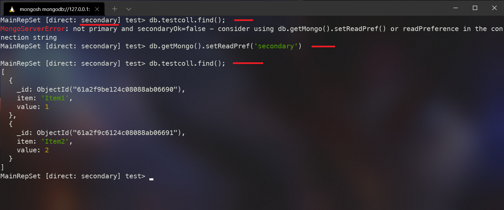
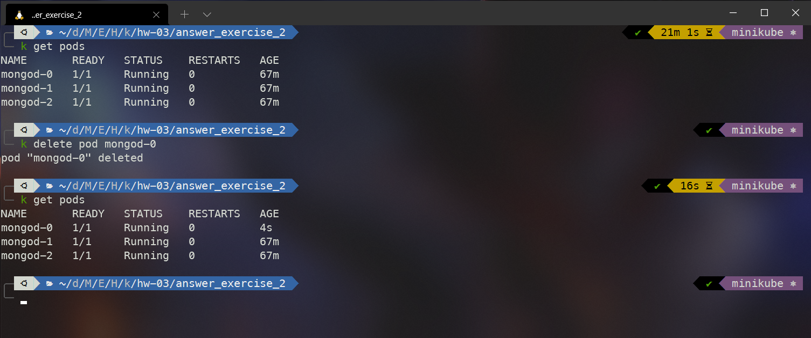
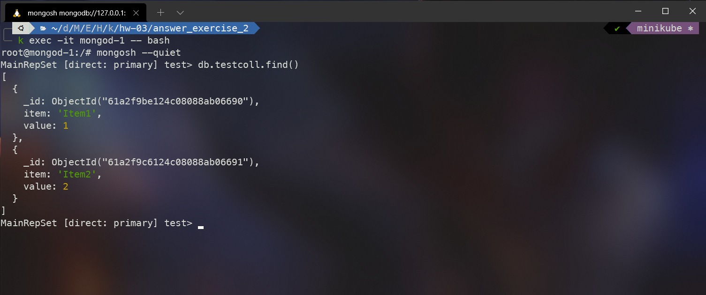

# answer_exercise_2

## StatefulSet y MongoDB

1. Creación de las tres instancias de `MongoDB`. El archivo de configuración crea los objetos `Service`, `StatefulSet` y `PersistentVolume`.

```
k apply -f mongo-statefulset.yaml

k get all
```



2. Entrar al `Pod` mongod-0 y crear una Réplica en `MongoDB`.

```
k exec -it mongod-0 -- bash

mongosh --quiet

rs.initiate({_id: "MainRepSet", version: 1, members: [
       { _id: 0, host : "mongod-0.mongodb-service.default.svc.cluster.local:27017" },
       { _id: 1, host : "mongod-1.mongodb-service.default.svc.cluster.local:27017" },
       { _id: 2, host : "mongod-2.mongodb-service.default.svc.cluster.local:27017" }
 ]});
```



3. Insertar un par de registros a la bd test.

```
db.testcoll.insertOne({ item: "Item1", value: 1 });
db.testcoll.insertOne({ item: "Item2", value: 2 });

db.testcoll.find();
```



4. Entrar al `Pod` mongod-2 y ver los registros insertados.

```
k exec -it mongod-2 -- bash

mongosh --quiet

db.getMongo().setReadPref('secondary')
db.testcoll.find()
```



5. Borrar el `Pod` mongod-0 y entrar al nodo mongod-1 para ver los registros

```
k get pods
k delete pod mongod-0
k get pods
```



El `Pod` mongod-1 paso a ser el primario



6. Diferencias que existiría si el montaje se hubiera realizado con el objeto de
   `ReplicaSet`

En el objeto `ReplicaSet` los `Pods` no tiene un estado único y sus nombres son dinámicos. En el momento que un `Pod` falla o es borrado, habría que modificar la réplica set en `MongoDB` para indicarle que un miembro ya no existe y configurar el nuevo que ha creado `Kubernetes`.
