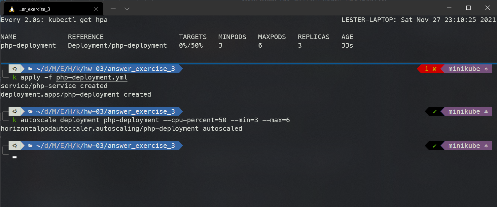
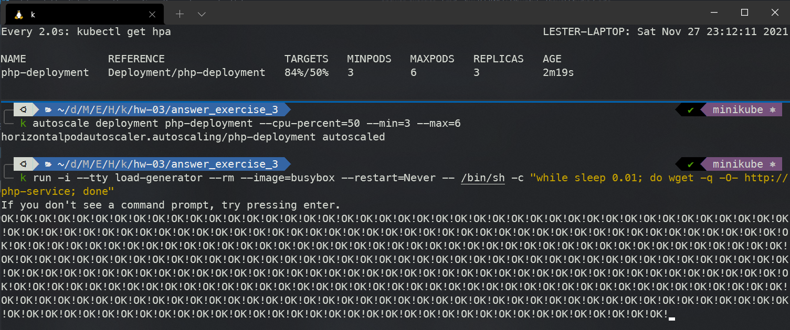
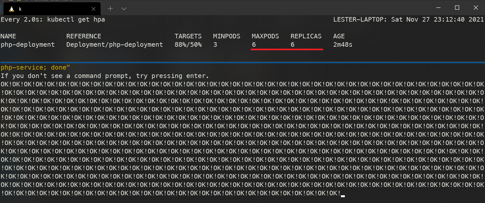

# answer_exercise_3

## Horizontal Pod Autoscaler

**Nota: Utilice la imagen de PHP-Apache que ofrece la documentación de Kubernetes ya que esta realiza operaciones con el cpu**

1. Creación del objeto `Deployment`

```
k apply -f php-deployment.yml
```

2. Crear el objeto `HPA`

```
k autoscale deployment php-deployment --cpu-percent=50 --min=3 --max=6
```

3. Comando para ver el `HPA`

```
watch kubectl get hpa
```



4. Prueba de stress

```
k run -i --tty load-generator --rm --image=busybox --restart=Never -- /bin/sh -c "while sleep 0.01; do wget -q -O- http://php-service; done"
```



